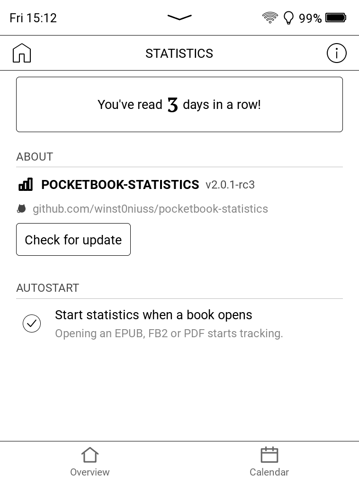
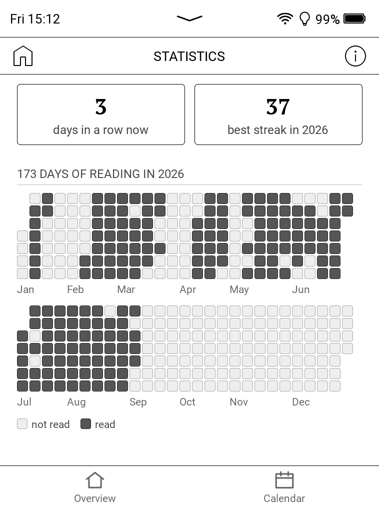
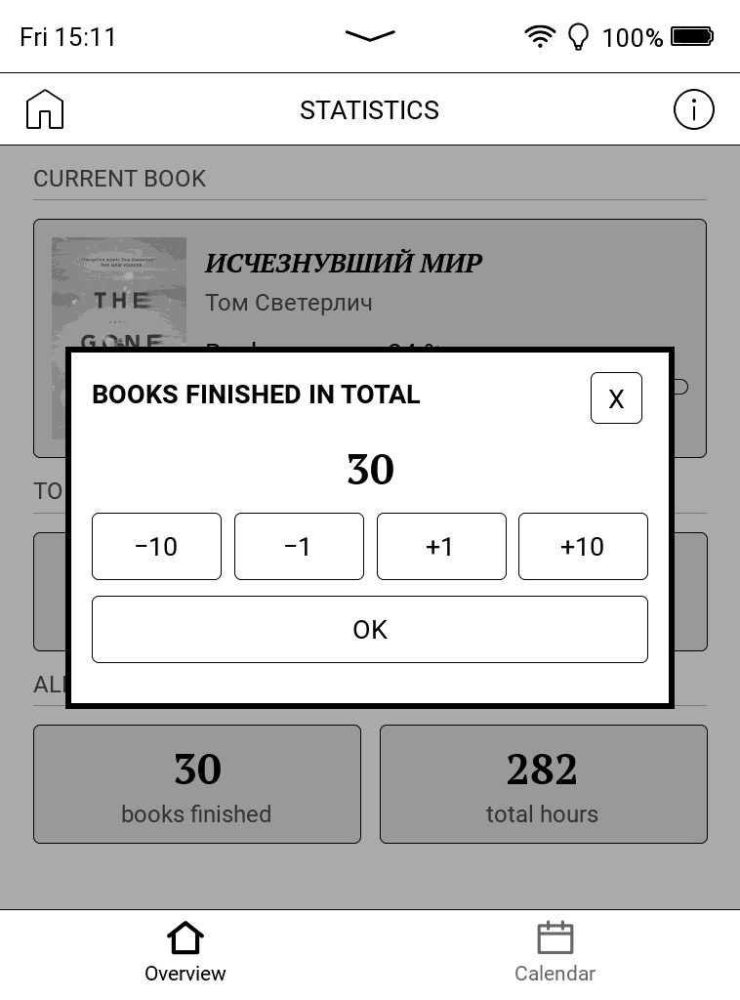
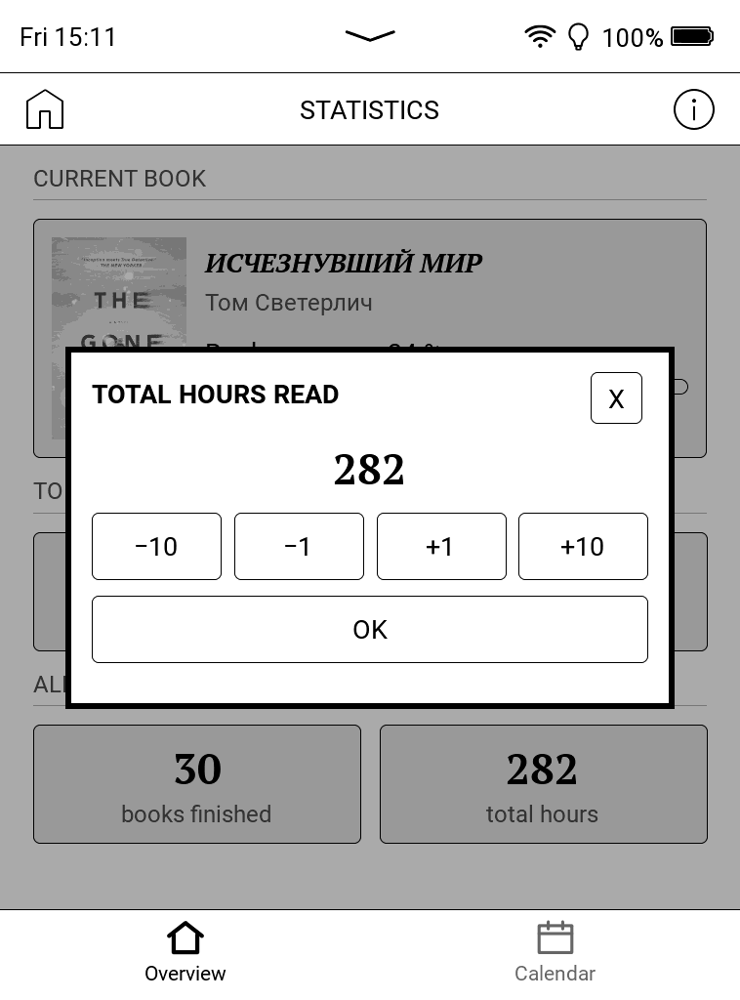

# PocketBook Statistics

Reading statistics for stock PocketBook e-readers. The firmware already records
what you read and when you last touched it; this app turns that into a stats
screen, built from the firmware's own UI components, so it looks like a part of
the reader rather than a visitor.

  

The overview on a PB629. The app follows the device
language.

## Overview

The book in hand with its cover, how far through it you are, and how long is
left at your own measured pace. Below it, today's minutes and pages per hour,
then the all-time count of books finished and hours read.

Tapping the cover or the title opens the book in the reader, and closing the
book brings you straight back here.

Every figure was measured. Nothing is guessed from the size of your library, and
the screens re-read their numbers when you return from a book, so what you just
read is already on them.

## Calendar

  
  

A month at a time. Each day carries the cover of whatever you read most that
day, and a badge when there was more than one book. The heading counts the days
you read and the hours they came to.

Tap a day and the panel lists what was open that day and for how long. Tap a
book inside it for its own figures.

## The streak

  
  

The ⓘ screen opens with the number of days you have read in a row. Tap that card
and you get the year behind it: the run you are on now, the longest one of this
year, how many days of the year you read at all, and every day as a square, in
the shape a contribution graph has. Weekdays down, weeks across, January to June
above July to December.

Days from before you installed the app are drawn as empty outlines instead of as
days without reading, because nothing was measuring then.

## Totals you can correct

  
  

The two all-time figures only count what this app saw on this reader. If you
read for years before installing it, or on another device, press and hold
**books finished** or **total hours** and set the number you want. The steps go
in ones and tens, OK saves, the X leaves the card as it was.

What you add is kept apart from the measurements and stored as a difference
rather than as a total, so today's reading still adds to it. Nothing else moves:
the pace, the calendar, the day panel and the streak stay exactly what they
were.

## How it works

A daemon inside the same binary reads the firmware's library database, read
only, every 30 seconds, and turns movements of your reading position into
sessions.

The firmware saves your position only every so often, so a single stretch of
clock can hold both the reading and the hours the cover lay shut. It is credited
only as far as the pages turned across it make plausible, at most five minutes a
page, and the time the reader spent asleep is subtracted first. Jumping is not
reading either: following a footnote to the back of the book, or returning to a
bookmark, buys neither minutes nor pages, and what you read from where you land
is counted from there. Sessions are split at local midnight, so one day's
figures are that day's.

Nothing starts at boot, because the firmware has no place for that outside its
own partition. Instead, ⓘ offers to track **from the moment a book opens**: the
app registers itself as the handler for EPUB, FB2 and PDF, starts the daemon
when you open a book, and hands the book straight to the usual reader. With that
switch off, open the app once after switching the reader on.

Time missed while the daemon was down is reconstructed from the firmware's
timestamps, capped, and marked as an estimate: it counts toward total hours but
never toward averages. Days before the install date are drawn as unknown rather
than as days without reading. "Finished" always means the firmware's own *mark
as read* flag, so it matches what the Library shows.

Covers are extracted from the book files themselves, EPUB, FB2 and CBZ, when the
firmware's cache is wrong or missing, and kept in the app's own cache. That is
why a finished book still has a thumbnail after you delete the file. The
interface follows the device language across 29 of them.

If something goes wrong, `system/pocketbook-statistics/app.log` has it: the app
and its daemon both write there, one line per event. The ⓘ screen shows the last
lines of it when an update fails; otherwise read the file over USB.

## Privacy

Nothing is uploaded: no account, no telemetry. The app reads the firmware's
database and writes its own files under `system/pocketbook-statistics/`. One
request ever goes out, to `api.github.com`, and only when you press *Check for
update*.

## Supported devices

Developed and tested on a **PocketBook Verse (PB629), firmware
U629.6.10.1461**. Other Allwinner **B288/B300** readers on Qt 6.8 firmware
should work, but none has been tried. The binary links the Qt that is already on
the reader, so firmware carrying a different version of it will not load the
app.

## Install

1. Download the `.zip` from the [latest release](../../releases/latest) and
   unpack it.
2. Copy `PocketBookStatistics.app` to `applications/` on the reader over USB.
3. Eject, open the app once, then reboot so the launcher icon appears.

Updating afterwards is ⓘ → *Check for update*. To uninstall, delete the `.app`,
restore `view.json` from the backup beside it, and delete
`system/pocketbook-statistics/`.

## Build

One ARM binary, app and daemon in one, linking the Qt 6.8.2 already on the
reader. `make sdk` once, then `make qt`; `make test` runs the host-side tests.
Details in [BUILDING.md](BUILDING.md), the firmware's data in
[docs/DEVICE-DATA.md](docs/DEVICE-DATA.md).

## License

MIT, see [LICENSE](LICENSE). Bundles [SQLite](https://www.sqlite.org/) and
[miniz](https://github.com/richgel999/miniz); cross-compilation builds on
[fstanis/pocketbook-sdk-qt6](https://github.com/fstanis/pocketbook-sdk-qt6).

## Disclaimer

Not affiliated with PocketBook. Use at your own risk. It only reads the firmware
database. Its optional configuration edits are backed up, but you are installing
third-party software on your device.
