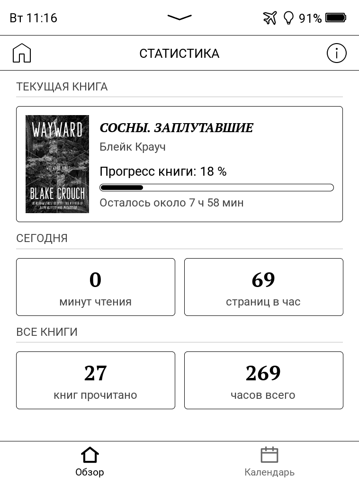
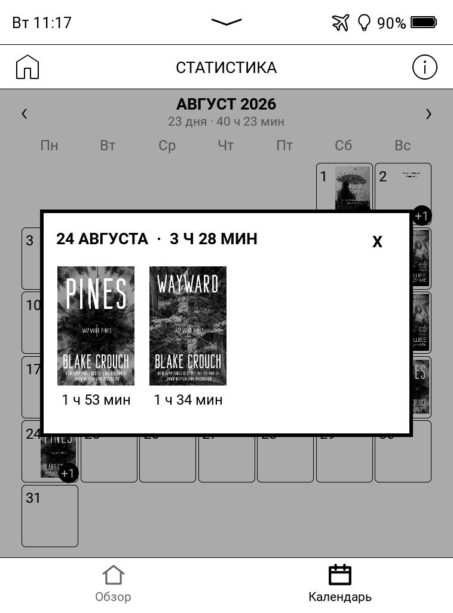

# PocketBook Statistics

Reading statistics for stock PocketBook e-readers. The firmware records what you
read and when you last touched it; this app turns that into a stats screen,
built from the firmware's own UI components.

> Developed and tested on a **PocketBook Verse (PB629), firmware
> U629.6.10.1461**. Other Allwinner **B288/B300** readers on Qt 6.8 firmware
> should work, but none has been tried.

  
  
  

Overview &middot; calendar &middot; one day's breakdown.
Screenshots from a PB629 set to Russian; the app follows the device
language.

## What it shows

- **Overview** — three sections. *Current book*: cover, progress, and how long
  is left at your own measured pace. *Today*: minutes read and pages per hour.
  *All books*: books finished and hours in total.
- **Calendar** — a month at a time, each day carrying the cover of what you read
  most. Tap a day for the breakdown, a book for its detail.

Every figure is something that was measured. Nothing is inferred from the size
of your library.

The **ⓘ** in the header holds the version, the update button and one setting.
The screens re-read their figures when you come back from a book, so what you
just read is already there.

## How it works

A daemon in the same binary reads the firmware's library database — read-only,
every 30 seconds — and turns movements of your reading position into sessions.
The firmware saves your position only every so often, so one stretch of clock
can hold both the reading and the hours the cover lay shut: it is credited only
as far as the pages turned across it make plausible — at most five minutes a
page — and the time the reader spent asleep is subtracted before that.
Jumping is not reading: following a footnote to the back of the book, or
returning to a bookmark, buys neither minutes nor pages, and what you read from
where you land is counted from there. Sessions split at local midnight, so one
day's figures are that day's.

Nothing starts at boot: the firmware has no place for that outside its own
partition. Instead, ⓘ offers to track **from the moment a book opens** — the app
registers itself as the handler for EPUB, FB2 and PDF, starts the daemon when
you open a book and hands the book straight to the usual reader. With that off,
open the app once after switching the reader on.

Time missed while the daemon was down is reconstructed from the firmware's
timestamps, capped, and marked as an estimate: it counts toward total hours but
never toward averages. Days before the install date are drawn as unknown rather
than as days without reading. "Finished" always means the firmware's own *mark
as read* flag.

Covers are extracted from the book files themselves — EPUB, FB2, CBZ — when the
firmware's cache is wrong, and kept in the app's own cache, which is why a
finished book still has a thumbnail after you delete the file. The interface
follows the device language across 29 of them.

If something goes wrong, `system/pocketbook-statistics/app.log` has it: the app
and its daemon both write there, one line per event. The ⓘ screen shows the last
lines of it when an update fails; otherwise read the file over USB.

## Privacy

Nothing is uploaded: no account, no telemetry. The app reads the firmware's
database and writes its own files under `system/pocketbook-statistics/`. One
request goes out, to `api.github.com`, and only when you press *Check for
update*.

## Install

1. Download the `.zip` from the [latest release](../../releases/latest) and
   unpack it.
2. Copy `PocketBookStatistics.app` to `applications/` on the reader over USB.
3. Eject, open the app once, then reboot so the launcher icon appears.

Updating afterwards is ⓘ → *Check for update*. To uninstall, delete the `.app`,
restore `view.json` from the backup beside it, and delete
`system/pocketbook-statistics/`.

## Build

One ARM binary, app and daemon in one, linking the Qt 6.8.2 already on the
reader. `make sdk` once, then `make qt`; `make test` runs the host-side tests.
Details in [BUILDING.md](BUILDING.md), the firmware's data in
[docs/DEVICE-DATA.md](docs/DEVICE-DATA.md).

## Thanks

To [nikljuel](https://github.com/nikljuel) for
[better-stats](https://github.com/nikljuel/better-stats), which is where the
idea came from: it showed that reading statistics on stock PocketBook firmware
were possible at all. This app was written after studying how that one works,
with the emphasis put elsewhere — its own session tracking, and a daemon that
starts by itself when a book is opened.

## License

MIT — see [LICENSE](LICENSE). Bundles [SQLite](https://www.sqlite.org/) and
[miniz](https://github.com/richgel999/miniz); cross-compilation builds on
[fstanis/pocketbook-sdk-qt6](https://github.com/fstanis/pocketbook-sdk-qt6).
Not affiliated with PocketBook — third-party software on your reader, at your
own risk.
